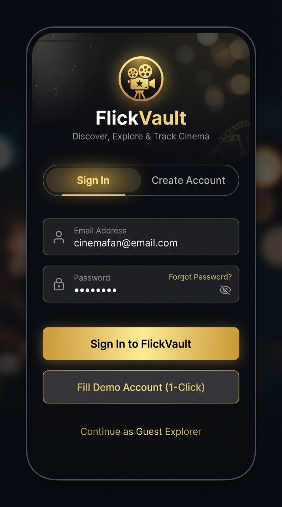
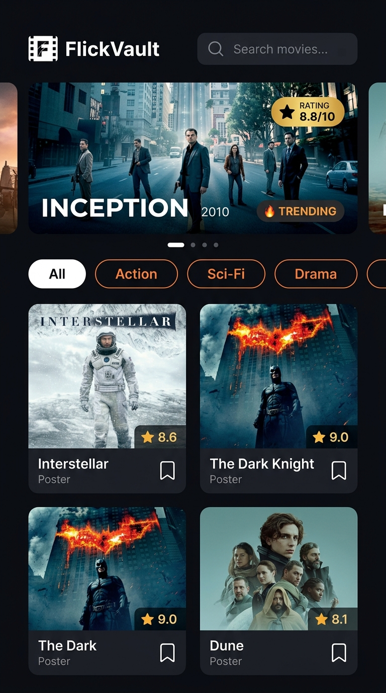
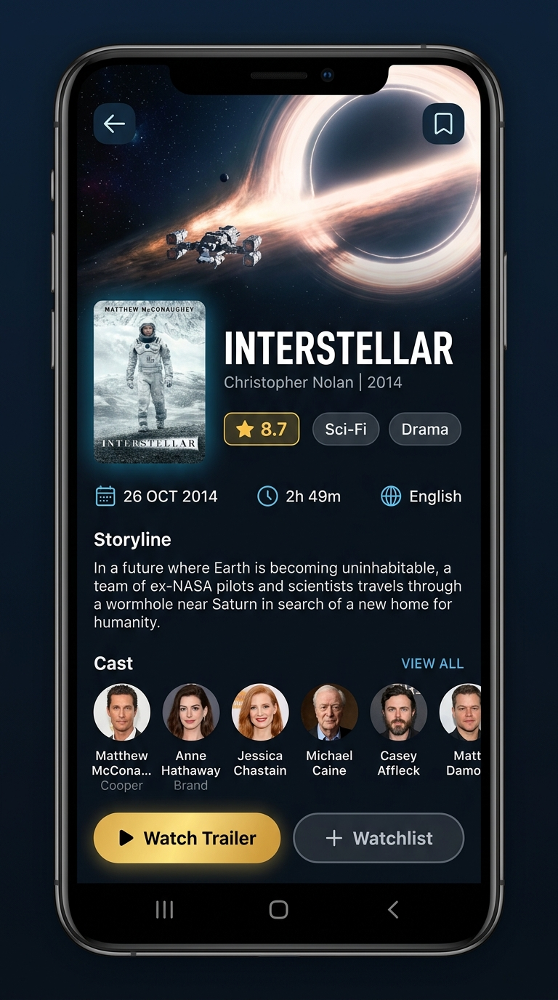
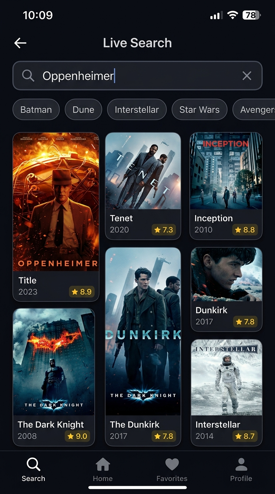

# 🎬 FlickVault — Modern Flutter Movie Application
> **GDG & DCS Recruitment Task Submission**  
> Built with Flutter & Dart for Android & iOS. Inspired by [Dribbble: Movie Application 03](https://dribbble.com/shots/6444124-Movie-application-03).

[](https://flutter.dev)
[](https://dart.dev)
[](https://flutter.dev)
[](https://developer.themoviedb.org)
[](https://github.com/Ranker-AdhipKumar/Movie-app-design-project/actions)

[-181717?style=for-the-badge&logo=github&logoColor=white)](https://github.com/Ranker-AdhipKumar/Movie-app-design-project/raw/main/Direct_apk_file/app-release.apk)
[](https://drive.google.com/file/d/1CTwMfOxiz7cH8CfD8EH0r4ViAU4Sj6Pb/view?usp=sharing)

> 📲 **Directly Download the Demo APK:**  
> - ⚡ **[Download from GitHub Repo (Direct_apk_file/app-release.apk)](https://github.com/Ranker-AdhipKumar/Movie-app-design-project/raw/main/Direct_apk_file/app-release.apk)**  
> - ☁️ **[Download from Google Drive](https://drive.google.com/file/d/1CTwMfOxiz7cH8CfD8EH0r4ViAU4Sj6Pb/view?usp=sharing)**  

---

## 📸 App Screenshots

| 🔐 Login & Authentication | 🏠 Home Screen & Carousel | 📽️ Movie Detail & Cast | 🔍 Live TMDB Search |
| :---: | :---: | :---: | :---: |
|  |  |  |  |
| *Sign in, demo auto-fill & guest access* | *Featured carousel, genre chips & grid* | *Backdrop hero, metadata & cast* | *Debounced search & suggestions* |

---

## 🌟 Overview
**FlickVault** is a cinema browsing mobile application designed with a dark, immersive aesthetic, fluid navigation, and clean architecture.

The project demonstrates:
- **Authentication & Session Handling**: Protected routing where users sign in before accessing the movie collection, with demo credentials, form validation, and session lifecycle management.
- **UI/UX Craftsmanship**: Cinema dark mode theme, hero transitions, glassmorphic badges, category filter chips, and an auto-advancing featured carousel.
- **Robust Data Layer**: Dual-source architecture supporting **both** rich offline sample data (10+ blockbusters with full overviews, cast, ratings, and backdrops) **and** live integration with **The Movie Database (TMDB) API**.
- **Clean Architecture**: Strict separation of concerns (Models, Services, Repositories, Config, Widgets, Screens). No API keys are hardcoded in UI files.
- **Resilient UX**: Shimmer-like loading states, graceful network image error fallbacks, live debounced search, and error retry handlers.

---

## 🔑 Authentication & Session Handling

The app enforces a clean authentication gate before accessing the movie catalog:
- **🔐 Login & Registration**:
  - Sign In and Create Account toggle tabs with email & password validation.
  - Password visibility toggle (show/hide).
  - Error banner displays for invalid credentials or malformed inputs.
- **⚡ 1-Click Demo Fill Button**:
  - Evaluators can tap **"Fill Demo Account (1-Click)"** to auto-populate test credentials without typing:
    - **Email**: `demo@flickvault.com`
    - **Password**: `password123`
- **🚪 Guest Explorer Mode**:
  - Direct 1-tap option **"Continue as Guest Explorer"** to inspect the app instantly.
- **🔄 Session State & Logout**:
  - `AuthRepository` broadcasts session changes via `ChangeNotifier`.
  - Profile popup in the App Bar and dedicated Account card in Settings allow the user to **Sign Out** anytime, returning to the Login Screen.

---

## ✨ Features

### 1. 🏠 Home Screen (Post-Authentication)
- **Personalized Header**:
  - Welcomes the authenticated user with a greeting and avatar dropdown.
- **Featured Trending Carousel**:
  - Horizontal swipeable hero banner highlighting top trending movies.
  - Smooth page indicator dots and auto-scroll timer.
  - Fire badge, release year, age rating, and vote badge overlay.
- **Category Filter Chip Bar**:
  - Filter movies dynamically by genres: *All, Action, Sci-Fi, Drama, Animation, Comedy, Thriller, Adventure, Fantasy, Crime*.
- **Live Search Bar**:
  - Instant client-side & server-side filter with debounce.
  - Clear button and active search count.
- **Responsive Movie Grid**:
  - Displays movie poster, title, release year, genre tag, and vote score.
  - Interactive bookmark / watchlist toggle with instant feedback.
  - Tap card to navigate smoothly with `Hero` animation.

### 2. 📽️ Movie Detail Screen
- **Collapsible Hero Header**:
  - High-res movie backdrop image that smoothly fades to dark on scroll.
  - Floating Back button to return to the Home Screen.
  - Quick bookmark / watchlist save button.
- **Rich Movie Metadata**:
  - Large elevated movie poster with shared Hero transition.
  - Movie title and official tagline.
  - Rating badge (⭐ `8.4 / 10`) with vote count.
  - Quick Info Bar: **Release Date**, **Duration / Runtime** (e.g. `2h 28m`), **Original Language**, **Age Rating** (PG-13, R, PG).
- **Genre Badges**:
  - Styled genre chips representing all categories of the movie.
- **Storyline & Overview**:
  - Formatted synopsis with expandable **"Read more / Show less"** toggle.
- **Cast & Characters Carousel**:
  - Horizontal list of actors with profile pictures and character names.
- **Action Buttons**:
  - **"Watch Trailer"**: Interactive trailer preview modal sheet.
  - **"Add to Watchlist"**: One-tap toggle with status feedback.

### 3. 🔍 Dedicated Search Screen
- Real-time debounced query to TMDB's `/search/movie` endpoint.
- Popular quick-search recommendation tags (*Oppenheimer, Interstellar, Batman, Dune, etc.*).
- Friendly empty states when no results are found.
- Error state with "Retry Search" button.

### 4. ⚙️ App & API Settings (Evaluator Friendly)
- **Account & Session Card**: Displays active session user info with a **Sign Out** button.
- **Data Source Switcher**: Toggle between **Offline Sample Movies** and **Live TMDB API** with a single tap.
- **In-App API Key Configuration**: Evaluators can enter their own TMDB v3 API key directly within the app without touching code or recompiling.

---

## 🏷️ GitHub Repository Metadata (About Section)

- **Description**:
  > A sleek, dark-themed cinema browsing Flutter mobile application with authentication, session handling, TMDB API integration, offline sample dataset, featured carousel, category filtering, and movie details. Built for GDG & DCS Recruitment Task.

- **Topics / Tags**:
  `flutter` `dart` `authentication` `mobile-app` `movie-app` `tmdb-api` `ui-ux` `gdg` `cross-platform` `android` `clean-architecture` `dribbble-design` `cinema`

---

## 🏗️ Project Architecture

```
Movie_App_Design_Project/
├── Direct_apk_file/
│   └── app-release.apk              # Directly downloadable release APK in repository
├── screenshots/                     # UI screenshots of the working application
│   ├── 00_login_screen.jpg          # Login & registration screen preview
│   ├── 01_home_screen.jpg           # Home screen & featured carousel preview
│   ├── 02_movie_detail.jpg          # Detailed movie view preview
│   └── 03_search_screen.jpg         # Search screen preview
├── assets/
│   └── data/
│       └── sample_movies.json       # 10+ rich offline movie records with cast & media
├── lib/
│   ├── main.dart                    # App entry point, session gate & theme setup
│   ├── config/
│   │   ├── api_config.dart          # Decoupled TMDB URLs & API key management
│   │   ├── app_constants.dart       # App strings, categories, and fallback assets
│   │   └── app_theme.dart           # Custom dark cinema theme & color tokens
│   ├── models/
│   │   ├── user.dart                # User entity for session management
│   │   ├── movie.dart               # Complete movie domain model with getters & JSON parser
│   │   └── cast_member.dart         # Actor & character data model
│   ├── services/
│   │   ├── auth_service.dart        # Authentication service with demo accounts & validation
│   │   ├── tmdb_api_service.dart    # Live HTTP client for TMDB with error handling & timeouts
│   │   └── mock_movie_service.dart  # Offline asset loader with in-memory fallback
│   ├── repositories/
│   │   ├── auth_repository.dart     # Authentication state & session lifecycle manager
│   │   └── movie_repository.dart    # Movie catalog state, mode switching & favorites
│   ├── widgets/
│   │   ├── movie_card.dart          # Card widget for movie grid
│   │   ├── trending_carousel_card.dart # Featured banner card with gradient overlay
│   │   ├── category_chip_bar.dart   # Horizontal genre chips
│   │   ├── rating_badge.dart        # Compact star rating pill
│   │   ├── custom_search_bar.dart   # Styled search field with clear action
│   │   ├── custom_network_image.dart # Resilient network image with placeholder & error fallback
│   │   ├── section_header.dart      # Reusable section header
│   │   └── cast_card.dart           # Circular actor portrait card
│   └── screens/
│       ├── login_screen.dart        # Login & registration authentication screen
│       ├── home_screen.dart         # Main browsing screen
│       ├── movie_detail_screen.dart # Detailed movie view with hero transitions
│       ├── search_screen.dart       # Dedicated TMDB search screen
│       └── settings_screen.dart     # API key configuration & session manager
├── test/
│   ├── auth_test.dart               # Unit tests for authentication & session lifecycle
│   ├── movie_model_test.dart        # Unit tests for JSON parsing & model helpers
│   └── widget_test.dart             # Widget tests for app initialization & auth flow
├── android/                         # Complete Android project wrapper with Gradle 8.5
└── pubspec.yaml                     # Dependencies and asset declarations
```

---

## 🚀 How to Run

### Prerequisites
- [Flutter SDK](https://flutter.dev/docs/get-started/install) installed (version 3.0+).
- Android Studio / VS Code with Flutter extension.
- Android Emulator or physical device connected with USB debugging.

### Step 1: Clone the repository
```bash
git clone https://github.com/Ranker-AdhipKumar/Movie-app-design-project.git
cd Movie_App_Design_Project
```

### Step 2: Install dependencies
```bash
flutter pub get
```

### Step 3: Run the app
```bash
flutter run
```

---

## 🧪 Running Tests
Execute the unit and widget test suite:
```bash
flutter test
```

---

## 📥 Direct APK Download & Installation

You can directly download and install the ready-to-use demo APK via either method:

### ⚡ Option 1: Direct from this GitHub Repository
[-181717?style=for-the-badge&logo=github&logoColor=white)](https://github.com/Ranker-AdhipKumar/Movie-app-design-project/raw/main/Direct_apk_file/app-release.apk)

🔗 **Direct GitHub Download Link**:  
[https://github.com/Ranker-AdhipKumar/Movie-app-design-project/raw/main/Direct_apk_file/app-release.apk](https://github.com/Ranker-AdhipKumar/Movie-app-design-project/raw/main/Direct_apk_file/app-release.apk)

*(Stored directly in the `Direct_apk_file/app-release.apk` folder on GitHub)*

---

### ☁️ Option 2: Download from Google Drive
[](https://drive.google.com/file/d/1CTwMfOxiz7cH8CfD8EH0r4ViAU4Sj6Pb/view?usp=sharing)

🔗 **Direct Google Drive Link**:  
[https://drive.google.com/file/d/1CTwMfOxiz7cH8CfD8EH0r4ViAU4Sj6Pb/view?usp=sharing](https://drive.google.com/file/d/1CTwMfOxiz7cH8CfD8EH0r4ViAU4Sj6Pb/view?usp=sharing)

---

### Quick Installation Guide:
1. Tap either download link above and save `app-release.apk` to your Android device.
2. Locate the file in your device's **Downloads** folder and tap on it.
3. If prompted by Android, enable **"Allow from this source"** or **"Install unknown apps"**.
4. Tap **Install** and launch **FlickVault** to test the app!

---

## 📦 Building the Android APK from Source

To generate a standalone release APK for demo submission:
```bash
flutter build apk --release
```

The compiled APK will be located at:
```
build/app/outputs/flutter-apk/app-release.apk
```

---

## 📝 Submission Checklist
- [x] **Authentication**: Login & Sign Up screens, session handling, 1-click demo fill, guest mode.
- [x] **Source Code**: Pushed to public GitHub repository.
- [x] **Screens**: Home Screen with carousel & grid + Movie Detail Screen with back navigation.
- [x] **Images**: Movie posters, backdrops, and cast photos with placeholders and fallbacks.
- [x] **Details**: Title, rating, release year, language, runtime, genres, storyline overview.
- [x] **Bonus**: Real-time search + Category filter chips + Watchlist bookmarking.
- [x] **Data Handling**: 10+ sample movies via JSON + TMDB live API endpoints with error handling.
- [x] **Security**: API key decoupled from UI code with in-app configuration.
- [x] **Clean Code**: Documented, typed Dart code following Flutter lints.
- [x] **APK Build**: Automated release build via GitHub Actions workflow.

---

## 🎨 UI Reference & Design Attribution
- Inspired by Dribbble design: [Movie application 03](https://dribbble.com/shots/6444124-Movie-application-03).
- Data & Poster Art provided by [The Movie Database (TMDB)](https://www.themoviedb.org/).
